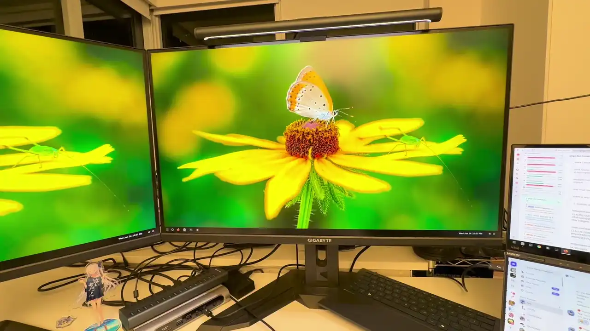
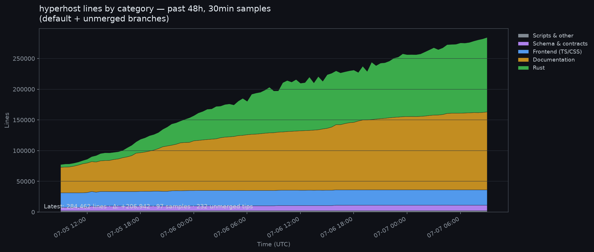

# RMNG

> Infrastructure for every 10x engineer.



## What problem does it solve?

Running one agent to develop software is easy. Running a dozen of them is painful:

You need a **separate sandbox** for each agent. RMNG gives each agent a full GNOME desktop, gpu acceleration, seperate network namespace, and seperate filesystem. Agents run real services side by side and never step on each other.

You need to **see and steer** each agent. A coding agent designing a web app or driving a GUI app is invisible from a terminal, and a laggy remote desktop makes supervising several of them miserable. RMNG's viewer is native and hardware-accelerated, runs at 60fps on LAN, and switches between clones instantly.

You need to **pack** a lot of agents onto one machine. RMNG's custom GPU accelerated remote desktop stack with a patched GNOME encodes only the clone you are watching, and lets you fit far more of them on the same hardware.

You need to **efficiently multi-task** with the fleet. RMNG watchs every desktop for you, and flags the exact clone that needs you your attention. An `rmng` CLI and a web dashboard drive the whole fleet, and automated Claude/Codex account rotation keeps agents working instead of stalling on limits.

## How does it solve it?

A remote-desktop stack written from scratch is the core of RMNG. It collects frames from every clone, encodes the selected clone's frames, and decodes them in a custom-built viewer with multi-monitor support over a zero-copy, GPU-accelerated H.264 pipeline that hits 60fps on LAN and preserves full-chroma 4:4:4 color even on hardware that only encodes 4:2:0. See the [Features](#features) section for the full list.

## How does it compare?

RMNG sits in the gap between desktop infrastructure and agent orchestration: real GPU desktops, local control, and a fast operator console.

| Capability                                                                  | RMNG | Terminal agent orchestrators (Conductor, Async) | IDE background agents (Cursor, Copilot) | Devin / Cognition | Agent desktop infra (Scrapybara, Bytebot) | Cloud desktop / VDI (Kasm) |
| --------------------------------------------------------------------------- | ---- | ----------------------------------------------- | --------------------------------------- | ----------------- | ----------------------------------------- | -------------------------- |
| Full GPU Linux desktop per agent                                            | ✅    | ❌ terminal/git only                             | ❌ inside the editor                     | ⚠️ opaque cloud VM | ✅                                         | ✅                          |
| One human oversees many agents at once                                      | ✅    | ⚠️ text panes                                    | ❌ one at a time                         | ❌ per-task        | ❌ infra, not oversight                    | ❌                          |
| Native hardware-accelerated viewer (60fps, multi-monitor, instant takeover) | ✅    | ❌                                               | ❌                                       | ❌                 | ⚠️ browser/WebRTC                          | ⚠️ browser/WebRTC           |
| Self hosted                                                                 | ✅    | ✅                                               | ❌ cloud                                 | ❌ cloud           | ❌ mostly hosted                           | ✅                          |
| Built for AI agents from the ground up                                      | ✅    | ✅                                               | ✅                                       | ✅                 | ✅                                         | ❌ VDI heritage             |

## Does it work?

RMNG builds Hyperhost, an unreleased cloud provider infrastructure product. One Fable 5 agent controls 20 agents running in RMNG clones, producing more than 100k lines of code per day.



## Features

**Remote Desktop**

- Zero-copy full-chroma 4:4:4 hardware H.264 pipeline end to end (even on hardware that only supports 4:2:0!)
- Native hardware-accelerated viewer on Linux and macOS
- 60fps on local network
- Multi-monitor
- Instant swap between clones
- Absolute and relative pointer
- Rich clipboard bridge, remote↔remote and local↔remote
- Port forwarding

**Fleet Management**

- One control-server Docker container is the web/API/media entrypoint
- Web dashboard with per-clone notes
- Docker + lxcfs clone isolation
- Full GNOME in each clone
- Central SMB share for clone file systems
- SSH bastion for clone access

**Agent Native**

- `rmng` fleet management CLI in every clone
- `rmng desktop` can target any clone for computer use
- Computer use MCP inside each clone
- Per-clone agent chat in the web UI
- Passive per-clone new-token accounting and server-owned activity lifecycle

**Accounts & integrations**

- Import Claude and ChatGPT accounts once and use in all the clones
- 5h + 7d usage visualizer for all accounts
- Live account hot-swap on a running clone, no restart needed
- Named account groups with sticky auto-rotation

## Quick start

> **Hardware support:** the encode path (control-server, VA-API H.264) has only been tested on an AMD Radeon Pro W6800; the decode path (viewer) has only been tested on Intel integrated graphics (Linux) and Apple M-series (macOS). Other GPUs may work but are untested.

Needs a Linux host with Docker and a GPU render node (`/dev/dri/renderD128`). Pull the published image (or `docker build -t rmng:latest .` from a checkout), then run the hub:

```sh
docker run -d --name rmng --privileged --init --pid host --restart unless-stopped \
  -v /var/run/docker.sock:/var/run/docker.sock \
  -v rmng-data:/data -v rmng-sock:/srv/rmng-sock \
  -p 9000:9000 -p 9001:9001 -p 9005:9005 -p 445:445 -p 2222:2222 pegasis0/rmng
```

Ports: `9000` web UI/API · `9001` video · `9005` port-forward data plane · `445` SMB clone-home share (host `445` must be free) · `2222` SSH bastion (jump into clones). The clone-local desktop MCP remains on internal port `9004`.

Open `http://<host>:9000`. The **first-run setup wizard** walks through the environment checklist, server settings, clone-template download, and setup completion. Full flow, image build, template publishing, upgrades, and the dev loop: [docs/DEPLOY.md](docs/DEPLOY.md). Running the Docker host on a Proxmox LXC CT: [docs/PROXMOX-LXC.md](docs/PROXMOX-LXC.md).
